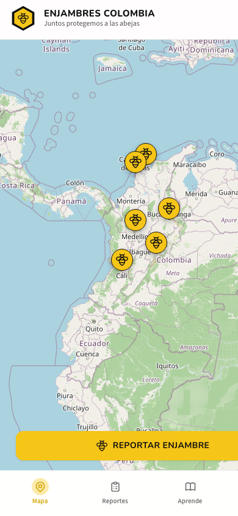

# Enjambres Colombia



**Webapp hoy, app completa mañana** — empezamos como webapp (SPA mobile-first) con visión de app nativa en App Store y Play Store (Capacitor reutilizando el mismo UI).

> _Juntos protegemos a las abejas._

Monorepo pnpm con POC v0 en `apps/web` (UI + datos mock, sin backend). Documentación técnica en [`docs/`](./docs/).

## Qué tipo de app es

|                   |                                                                                    |
| ----------------- | ---------------------------------------------------------------------------------- |
| **Tipo**          | Webapp ahora → app móvil completa (v2, Capacitor)                                  |
| **Dominio**       | Conservación / ciencia ciudadana                                                   |
| **Usuarios**      | Ciudadanos que reportan enjambres; apicultores y rescatistas que atienden reportes |
| **Plataforma v1** | Navegador (mobile-first)                                                           |
| **Plataforma v2** | iOS + Android (misma UI, shell nativo)                                             |

### Funcionalidad principal

1. **Reportar enjambre** — foto + ubicación en el mapa
2. **Mapa en vivo** — ver reportes cercanos (clustering por zona)
3. **Flujo comunitario** — reporta → localizamos → rescatamos → protegemos
4. **Secciones** — Mapa, Reportes, Aprende (contenido educativo), Perfil

Screenshot del POC actual arriba. Mockup de diseño original: [`docs/ENJAMBRE.jpeg`](./docs/ENJAMBRE.jpeg) — análisis en [`docs/mockup-analysis.md`](./docs/mockup-analysis.md).

Documentación técnica (inglés): [`docs/README.md`](./docs/README.md) — decisiones de arquitectura, análisis del mockup, estructura del monorepo.

## Convenciones

| Área                                                              | Idioma  |
| ----------------------------------------------------------------- | ------- |
| Código (identificadores, comentarios en código, commits técnicos) | Inglés  |
| Copy (texto de UI, documentación, mensajes al usuario)            | Español |

---

## Stack

| Herramienta              | Rol                              |
| ------------------------ | -------------------------------- |
| **Node.js** (latest LTS) | Runtime de JavaScript            |
| **asdf**                 | Gestor de versiones (Node, etc.) |
| **Corepack + pnpm**      | Gestor de paquetes               |
| **React**                | Biblioteca de UI                 |
| **React Aria**           | Componentes accesibles (Adobe)   |
| **Tailwind CSS**         | Estilos con utilidades           |

---

## 1. asdf — instalar y usar Node.js (latest)

[asdf](https://asdf-vm.com/) permite fijar la versión de Node por proyecto.

### Instalar asdf (macOS)

```bash
brew install asdf
```

Agrega asdf a tu shell (ejemplo con zsh):

```bash
echo -e "\n. $(brew --prefix asdf)/libexec/asdf.sh" >> ~/.zshrc
source ~/.zshrc
```

### Plugin de Node y versión más reciente

```bash
asdf plugin add nodejs
asdf install nodejs latest
asdf global nodejs latest
node --version
npm --version
```

### Fijar versión en este proyecto (opcional)

Crea un archivo `.tool-versions` en la raíz del repo:

```
nodejs latest
```

---

## 2. Corepack y pnpm

[Corepack](https://nodejs.org/api/corepack.html) viene incluido con Node 16.10+ y habilita gestores como pnpm sin instalarlos de forma global.

```bash
corepack enable
corepack prepare pnpm@latest --activate
pnpm --version
```

### Comandos habituales de pnpm

```bash
pnpm install          # install dependencies
pnpm add <package>    # add a dependency
pnpm run dev          # start dev server
pnpm run build        # production build
pnpm lint             # ESLint
pnpm test             # Vitest (UI render/click)
pnpm typecheck        # TypeScript across packages
```

---

## 3. React Aria

[React Aria](https://react-spectrum.adobe.com/react-aria/) ofrece hooks y componentes accesibles (WAI-ARIA, teclado, lectores de pantalla).

Documentación oficial:

- [Getting started](https://react-spectrum.adobe.com/react-aria/getting-started.html)
- [Components](https://react-spectrum.adobe.com/react-aria/components.html)

React Aria se integra bien con Tailwind: los componentes exponen estados (`data-hovered`, `data-pressed`, etc.) que puedes estilizar con clases de utilidad.

---

## 4. Tailwind CSS

[Tailwind CSS](https://tailwindcss.com/) es un framework de utilidades CSS.

Guía oficial: [Install Tailwind with Vite](https://tailwindcss.com/docs/installation/using-vite)

---

## Arranque local

```bash
corepack enable
pnpm install
cp apps/web/.env.example apps/web/.env.local   # luego edita la key
pnpm dev          # http://localhost:3000 — apps/web
pnpm build        # build de todos los paquetes
```

### Variables de entorno (`apps/web`)

| Variable             | Descripción                                                                      |
| -------------------- | -------------------------------------------------------------------------------- |
| `VITE_CARTO_API_KEY` | API key de Carto para el mapa (tiles). Opcional: sin key se usan tiles públicos. |

1. Copia el template: `cp apps/web/.env.example apps/web/.env.local`
2. Pon tu key en `.env.local` (gitignored; no la subas al repo)
3. En Vercel/Cursor, define `VITE_CARTO_API_KEY` en la UI de secrets/env

Reinicia el servidor de Vite después de cambiar env vars.

---

## Estructura del monorepo

```
enjambreapp/
├── apps/
│   ├── web/                 # Vite + React SPA (v0 POC)
│   │   ├── .env.example     # template de env (copiar a .env.local)
│   │   └── …
│   └── mobile/              # (v2) Capacitor → App Store / Play Store
├── packages/
│   ├── ui/                  # React Aria + Tailwind components
│   ├── types/               # shared types (Report, User, …)
│   └── config/              # shared tsconfig
├── docs/
│   ├── app-screenshot.png   # captura actual del POC (README)
│   ├── ENJAMBRE.jpeg        # mockup de diseño original
│   ├── mockup-analysis.md
│   └── decisions/           # ADRs
├── pnpm-workspace.yaml
├── package.json
└── README.md
```

Ver [`docs/decisions/002-monorepo-structure.md`](./docs/decisions/002-monorepo-structure.md) para detalles.

---

## Licencia

Por definir.
